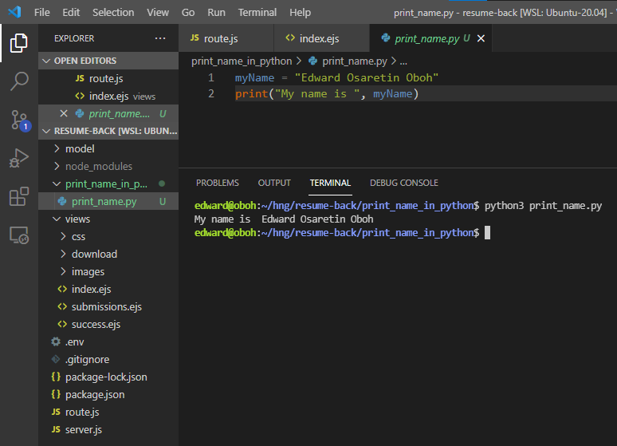

# HNGi8 Stage 2 Task - [Portfolio/Resume With Interactive Contact Form]

## VS Code Successfully Installed 
VSCode was Successfully installed and used as the primary code Editor for all Programming tasks.

## Program To print my Name
The Program written to print my name is contained in the **print_name_in_python** directory and the programming language used is **Python**.

Below is a Screenshot of the program being executed

## Track = Frontend and Backend
I am running two tracks, frontend and backend. This is my submission for the **Frontend** track. Backend Task has been submitted

## HNG | I4G | Zuri.Team
The Logos and links for HNG, I4G and Zuri.Team are contained at the bottom of the page